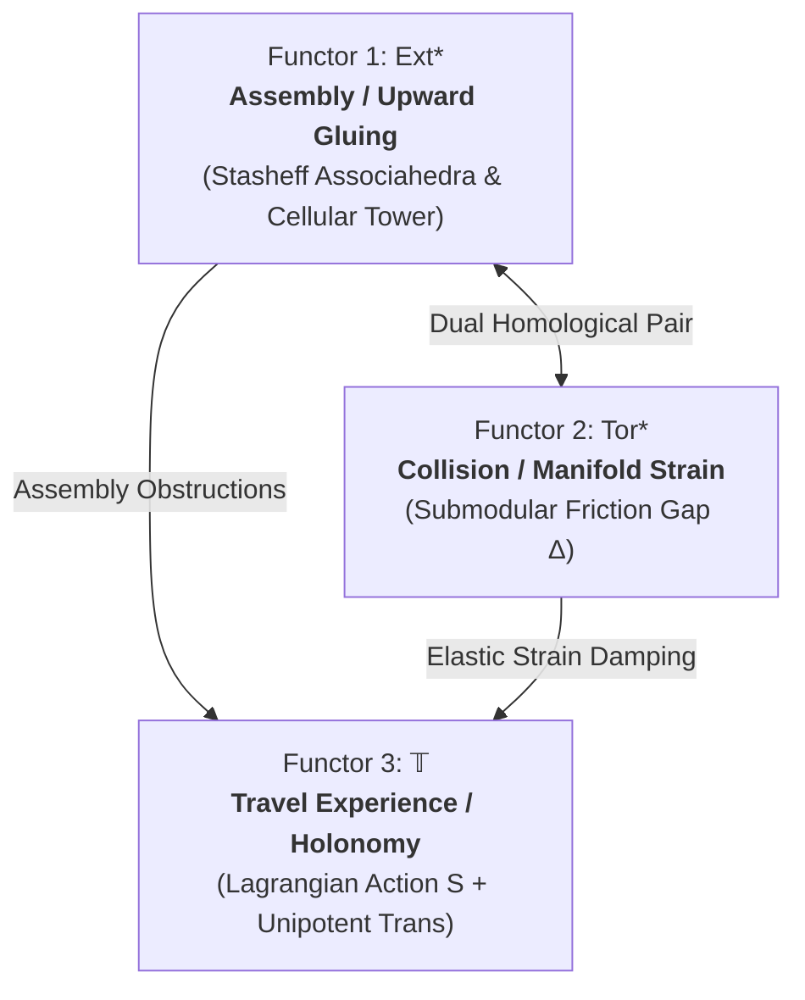
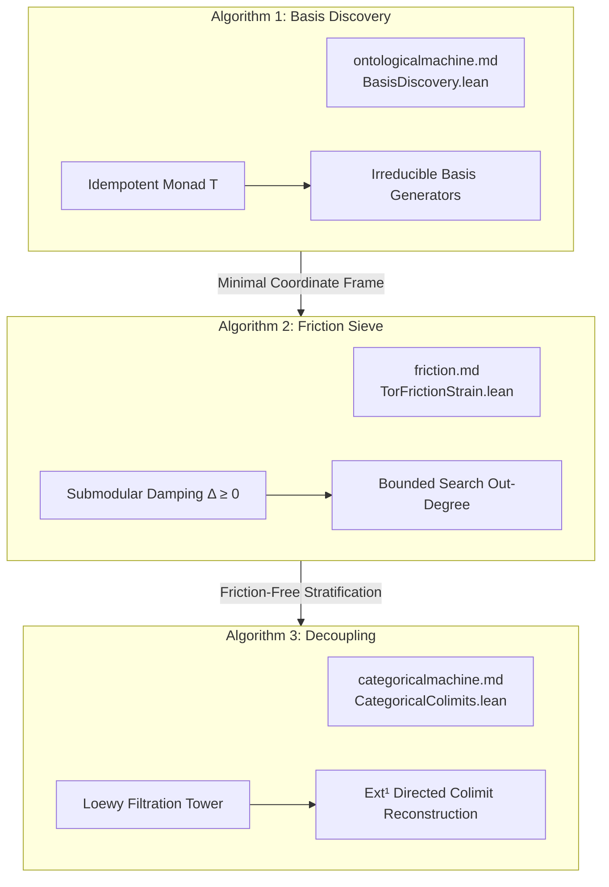

# Lattice Theory as a Thin Category: The Crystalline Tower, Three Functors, and Algorithmic Decomposition

## Abstract

This document formalizes the foundational architecture unifying discrete lattice theory, homological algebra, and geometric representation theory. By viewing a lattice $(L, \le)$ as a **thin category**, the discrete containment order is elevated into a functorial substrate. 

Across this substrate, three fundamental functors operate:
1. **The $\mathrm{Ext}^*$ Functor (Assembly & Internal Stress):** Glues simple layers upward into cellular towers, generating the infinite family of Stasheff Associahedra ($K_2 \to K_\infty$) and Cartan-Killing Lie root lattices ($A_1 \to A_\infty$).
2. **The $\mathrm{Tor}_*$ Functor (Collision & Manifold Strain):** Measures the derived intersection defect of subobjects, identifying the Submodular Friction Gap $\Delta(A, B)$ as $\dim \mathrm{Tor}_1(X/A, X/B)$ and quantifying elastic manifold strain.
3. **The Travel Functor $\mathbb{T} = (\mathcal{S}, \mathbf{Trans})$ (Path Experience):** Unifies the accumulated Lagrangian friction action $\mathcal{S}$ and unipotent matrix holonomy $\mathbf{Trans}$ experienced when traversing covering edges in the lattice.

These functors provide the exact geometric and homological engine powering three core algorithms: **Basis Discovery**, the **Algorithmic Friction Sieve**, and the **Decoupling Algorithm**. All core theorems are machine-checked in Lean 4 with zero `sorry` placeholders.

---

## 1. The Substrate: Lattice Theory as a Thin Category

In classical algebra, a lattice is a static set $(L, \wedge, \vee, \le)$. In this framework, $(L, \le)$ is canonically a **thin category** $\mathcal{C}_L$:
- **Objects:** Elements $x \in L$.
- **Morphisms:** For any $x, y \in L$, $|\mathrm{Hom}_L(x, y)| \le 1$. A unique arrow $x \xrightarrow{\;\iota\;} y$ exists if and only if $x \le y$.
- **Composition & Identities:** Transitivity ($x \to y \to z \implies x \to z$) and reflexivity ($x \to x$).

### The Categorical Dictionary

| Lattice Concept | Thin Category Equivalent | Universal Property |
| :--- | :--- | :--- |
| **Partial Order** $\le$ | Unique morphism $x \to y$ | Arrows of thin category |
| **Bottom** $\bot$ / **Top** $\top$ | Initial $\mathbf{0}$ / Terminal $\mathbf{1}$ | $\mathrm{Hom}(\bot, x) = \{*\}$, $\mathrm{Hom}(x, \top) = \{*\}$ |
| **Meet** $x \wedge y$ | Binary Product $x \times y$ | Categorical Limit of discrete 2-object diagram |
| **Join** $x \vee y$ | Binary Coproduct $x \amalg y$ | Categorical Colimit of discrete 2-object diagram |
| **Infimum** $\bigwedge S$ | Small Limit $\varprojlim_{s \in S} s$ | Universal cone under diagram $S$ |
| **Supremum** $\bigvee S$ | Small Colimit $\varinjlim_{s \in S} s$ | Universal cocone over diagram $S$ |
| **Monotone Map** $f: L \to M$ | Functor $F: L \to M$ | $x \le y \implies F(x) \le F(y)$ |
| **Galois Connection** $f \dashv g$ | Adjunction $F \dashv G$ | $\mathrm{Hom}_M(F(x), y) \cong \mathrm{Hom}_L(x, G(y))$ |
| **Closure Operator** $\mathrm{cl} = g \circ f$ | Idempotent Monad $(T, \eta, \mu)$ | $T^2 \cong T$ on thin category |
| **Closed Elements** $\mathrm{Fix}(\mathrm{cl})$ | Eilenberg–Moore Category $L^T$ | Reflective subcategory of algebras |
| **Subobject Poset** $\mathrm{Sub}_{\mathcal{A}}(X)$ | Thin Modular Subcategory | Skeletal thin category of subobjects in $\mathcal{A}$ |

> [!THEOREM] Formal Properties of Thin Categories (Lean 4 Verified)
> 1. **Subsingleton Hom-sets:** For all $x, y$, `Subsingleton (x ⟶ y)`. Parallel arrows are strictly equal ($f = g$).
> 2. **All Morphisms are Monic and Epic:** For any $f: x \to y$, `Mono f` and `Epi f` hold unconditionally.
> 3. **Derived Flatness:** $\mathrm{Ext}_L^{\ge 1}(A, B) = 0$ and $\mathrm{Tor}_{\ge 1}^L(A, B) = 0$. The internal thin category is completely flat; all extensions and intersections split cleanly within the lattice order.

---

## 2. The Three Fundamental Functors

When the thin skeleton $\mathrm{Sub}(X)$ is lifted into an ambient abelian/derived category $\mathcal{A}$, the homological degrees of freedom re-emerge via three measuring functors:

---

### Functor 1: The $\mathrm{Ext}^*$ Functor (Assembly & Internal Stress)

$$
\mathbf{Ext}^n(A, B) = \mathbf{R}^n\mathrm{Hom}(A, B)
$$

$\mathrm{Ext}^*$ measures the **cohomological glue** required to assemble simple layers $S_1, S_2, \dots, S_n$ into the composite object $X$:

* **$\mathrm{Ext}^0(A, B) = \mathrm{Hom}(A, B)$:** Subobject containment (1 bit in $L$, linear maps in $\mathcal{A}$).
* **$\mathrm{Ext}^1(S_{k+1}, X_k)$:** 1-step short exact sequences $0 \to X_k \to X_{k+1} \to S_{k+1} \to 0$. Non-zero classes $e_k \ne 0$ represent non-split Jordan couplings and unipotent shear.
* **$\mathrm{Ext}^2(S_{k+2}, X_k)$:** Splicing classes $e_k \circ e_{k+1}$ and obstructions to simultaneous splitting.
* **$\mathrm{Ext}^3(S_4, X_1)$:** 3-step long-range depth, Massey products $\langle e_3, e_2, e_1 \rangle$, and global dimension barriers.
* **$\mathrm{Ext}^4$ & Beyond:** 4th-order syzygy modules and $A_\infty$-homotopy operations $m_4$.

#### The Phase Transition at Degree 4
Between degree 3 and degree 4, the algebra undergoes a geometric phase transition:
1. **Solvability Boundary:** Permutations transition from solvable symmetric groups ($S_2, S_3, S_4$) to non-solvable groups ($S_5$ containing the simple icosahedral group $A_5$).
2. **Dimension Jump:** Associativity moves transition from 1D intervals ($K_3$) and 2D pentagons ($K_4$) into the **3D Associahedron $K_5$** and higher $n$-dimensional polytopes.
3. **Universal Coherence (Mac Lane):** The 2D interior of the Stasheff pentagon $K_4$ acts as the universal coherence threshold.

---

### Functor 2: The $\mathrm{Tor}_*$ Functor (Collision & Manifold Strain)

$$
\mathbf{Tor}_n(A, B) = \mathbf{L}_n(A \otimes B)
$$

$\mathrm{Tor}_*$ measures the **homological collision** when two subobjects meet ($A \cap B$):

* **$\mathrm{Tor}_0(A, B) = A \otimes B \equiv A \wedge B$:** The canonical lattice meet / intersection.
* **$\mathrm{Tor}_1(X/A, X/B)$:** The **Submodular Friction Defect $\Delta(A, B)$**. In any abelian category with subobjects $A, B \subseteq X$:

  $$
  0 \longrightarrow \mathbf{Tor}_1(X/A, X/B) \longrightarrow A \cap B \longrightarrow A \oplus B \longrightarrow A + B \longrightarrow 0
  $$

  Taking dimensions yields:

  $$
  \dim \mathbf{Tor}_1(X/A, X/B) = \big[\mathrm{rk}(A) + \mathrm{rk}(B)\big] - \big[\mathrm{rk}(A \vee B) + \mathrm{rk}(A \wedge B)\big] = \Delta(A, B) \ge 0
  $$

> [!DEFINITION] Modularity as Zero-Strain Equilibrium
> A lattice is modular if and only if the $\mathrm{Tor}_1$ friction defect vanishes identically ($\Delta \equiv 0$). Non-zero $\mathrm{Tor}_1$ directly measures derived geometric friction and search non-linearities.

* **Higher $\mathrm{Tor}_{\ge 2}$:** Compute derived intersection multiplicities and higher-order tangency corrections (Serre's intersection formula).

---

### Functor 3: The Travel Functor $\mathbb{T}$ (Lagrangian Action & Holonomy)

$$
\mathbb{T} : \mathcal{P}(L) \longrightarrow (\mathbb{N}, +) \times \mathbf{Unipotent}_2(\mathbb{Z})
$$

The Travel Functor evaluates the exact physical sensation of moving along a path $\gamma = (x_0 \to x_1 \to \dots \to x_n)$ in the lattice:

$$
\mathbb{T}(\gamma) = \Big( \underbrace{\mathcal{S}(\gamma)}_{\text{Lagrangian Friction Action}}, \;\; \underbrace{\mathbf{Trans}(\gamma)}_{\text{Unipotent Geometric Holonomy}} \Big)
$$

1. **Friction Action $\mathcal{S}$:** Measures the search inertia and fan-out effort:

   $$
   \mathcal{S}(x_k \lessdot x_{k+1}) = |\mathrm{Cov}^+(x_k)| + \text{Cartan Strain } \langle \Delta v, \Delta v \rangle
   $$

   - Efforts add along paths: $\mathcal{S}(\gamma_1 \odot \gamma_2) = \mathcal{S}(\gamma_1) + \mathcal{S}(\gamma_2)$.
   - Strict Action Increase: $\mathcal{S}(\text{step}) > 0 \implies \mathcal{S}(t \odot \text{step}) > \mathcal{S}(t)$ (No free travel).
2. **Unipotent Holonomy $\mathbf{Trans}$:** Measures the geometric shear twisting the state space:

   $$
   \mathbf{Trans}(x_k \lessdot x_{k+1}) = \begin{pmatrix} 1 & e_k \\ 0 & 1 \end{pmatrix} \in \mathbf{GL}_2(\mathbb{Z})
   $$

   - Shears multiply along paths: $\mathbf{Trans}(\gamma_1 \odot \gamma_2) = \mathbf{Trans}(\gamma_1) \cdot \mathbf{Trans}(\gamma_2)$.
   - Matrix multiplication produces linear addition in $\mathrm{Ext}^1$: $e_{\text{total}} = e_1 + e_2$.

---

## 3. The Crystalline Tower ($K_0 \longrightarrow K_\infty$)

The higher compositions of $\mathrm{Ext}^*$ and $\mathrm{Tor}_*$ unfold into an infinite, rigid polyhedral tower of **Stasheff Associahedra $K_n$**, corresponding to the **$A_{n-2}$ Cartan-Killing Root Systems**:

| Level | Dimension | Vertices (Catalan) | Lie Root | Boundary Facets | Physical Interpretation |
| :--- | :--- | :--- | :--- | :--- | :--- |
| **$K_0 / K_1$** | $\varnothing$ | $1$ | $A_0$ | $0$ | Vacuum / Standing Still $(0, \mathbf{1})$ |
| **$K_2$** | $0$D | $1$ | $A_1$ | $0$ | $0$D Point (Elementary 1-Step) |
| **$K_3$** | $1$D | $2$ | $A_1$ | $2$ Vertices | $1$D Line Segment $[0, 1]$ |
| **$K_4$** | **$2$D** | **$5$** | **$A_2$** | **$5$ Edges** | **$2$D Stasheff Pentagon (Tamari $\mathcal{T}_4$)** |
| **$K_5$** | **$3$D** | **$14$** | **$A_3$** | **$9$ Facets (6 Pent + 3 Sq)** | **$3$D Associahedron (Cartan Strain)** |
| **$K_6$** | **$4$D** | **$42$** | **$A_4$** | **$14$ 3D Cells** | **$4$D Spacetime Cluster Polytope** |
| **$K_7$** | $5$D | $132$ | $A_5$ | $20$ 4D Cells | $5$D Hyper-Polytope |
| **$K_n$** | $(n-2)$D | $C_{n-1} = \frac{1}{n}\binom{2n-2}{n-1}$ | $A_{n-2}$ | Cluster Variables | $(n-2)$D Universal $A_\infty$ Operad |

### The $A_3$ Root System Correspondence on $K_5$ (Lean 4 Verified)
The 3D Associahedron $K_5$ (governing 4-step / $\mathrm{Ext}^4$ compositions) has **exactly 9 boundary facets**, bijective to the 9 almost-positive roots of the $A_3$ Lie algebra:
- **6 Pentagonal Facets** $\longleftrightarrow$ The **6 Positive Roots** of $A_3$:

  $$
  \{\alpha_1, \; \alpha_2, \; \alpha_3, \; \alpha_1+\alpha_2, \; \alpha_2+\alpha_3, \; \alpha_1+\alpha_2+\alpha_3\}
  $$

- **3 Square Facets** $\longleftrightarrow$ The **3 Negative Simple Roots** of $A_3$:

  $$
  \{-\alpha_1, \; -\alpha_2, \; -\alpha_3\}
  $$

### Manifold Strain Metric on the $A_3$ Root Space
The Riemannian metric tensor on the root lattice $\mathbb{Z}^3$ is given by the Cartan matrix:

$$
\langle u, v \rangle = 2 u_1 v_1 + 2 u_2 v_2 + 2 u_3 v_3 - (u_1 v_2 + u_2 v_1) - (u_2 v_3 + u_3 v_2)
$$

The **Manifold Strain Energy** satisfies the positive-definite sum-of-squares decomposition:

$$
\text{Strain}(v) = \langle v, v \rangle = v_1^2 + (v_1 - v_2)^2 + (v_2 - v_3)^2 + v_3^2 \ge 0
$$

- Invariant root norms: $\|\alpha_i\|^2 = 2$ for all 6 positive roots.
- Off-diagonal shear strain: $\langle \alpha_1, \alpha_2 \rangle = -1$ (mutual $120^\circ$ pull).
- Orthogonal decoupling: $\langle \alpha_1, \alpha_3 \rangle = 0$ (independent subobjects).

> [!THEOREM] Holographic Boundary Law & Linear Geodesic Diameter
> 1. **Holographic Boundary Law:** The boundary of any associahedron decomposes into products of lower-dimensional associahedra:
>    $$
>    \partial K_n = \bigcup_{i + j = n + 1} K_i \times K_j
>    $$
> 2. **Sleator–Tarjan–Thurston Linear Bound:** While vertex count grows exponentially as Catalan numbers $C_n \sim \frac{4^n}{n^{3/2}\sqrt{\pi}}$, the **shortest path distance (graph diameter) across $K_n$ is strictly linear**:
>    $$
>    \mathrm{Diameter}(K_n) \le 2n - 6 \quad (\forall \, n \ge 16)
>    $$
>    Greedy algorithmic navigation across the crystalline tower scales linearly $O(n)$ in path length.

---

## 4. The Three Core Algorithms

The three functors and the thin category substrate power the three algorithmic engines of the repository:

1. **Basis Discovery Algorithm ([`ontologicalmachine.md`](ontologicalmachine.md) / [`BasisDiscovery.lean`](https://raw.githubusercontent.com/sh7vansh/universe/refs/heads/main/math_project/MathProject/BasisDiscovery.lean)):**
   - Operates on a complete lattice $L$ with closure operator $\mathrm{cl}$ (idempotent monad $T$).
   - Computes boundary differentials $\partial x = \bigvee_{y < x} y$ (colimit over the punctured slice category $(L \downarrow x)_{<}$).
   - Extracts the unique minimal generating set of colimit-irreducibles for the Eilenberg–Moore category $L^T$.
2. **Algorithmic Friction Sieve ([`friction.md`](friction.md) / [`Friction.lean`](https://raw.githubusercontent.com/sh7vansh/universe/refs/heads/main/math_project/MathProject/Friction.lean) / [`TorFrictionStrain.lean`](https://raw.githubusercontent.com/sh7vansh/universe/refs/heads/main/math_project/MathProject/TorFrictionStrain.lean)):**
   - Measures search complexity via the total branching factor $\mathcal{F} = \sum |\mathrm{Cov}^+(x)|$.
   - Proves that submodular rank functions ($\Delta(A, B) \ge 0$) act as elastic damping, preventing exponential Catalan explosion and forcing polynomial convergence.
3. **Decoupling Algorithm ([`categoricalmachine.md`](categoricalmachine.md) / [`CategoricalColimits.lean`](https://raw.githubusercontent.com/sh7vansh/universe/refs/heads/main/math_project/MathProject/CategoricalColimits.lean) / [`LoewyLength.lean`](https://raw.githubusercontent.com/sh7vansh/universe/refs/heads/main/math_project/MathProject/LoewyLength.lean) / [`YonedaExtension.lean`](https://raw.githubusercontent.com/sh7vansh/universe/refs/heads/main/math_project/MathProject/YonedaExtension.lean)):**
   - Traces the canonical Loewy filtration chain $\mathbf{0} = X_0 \subset X_1 \subset \dots \subset X_N = X$ in the thin subobject lattice $\mathrm{Sub}(X)$.
   - At each step $k$, extracts the simple quotient $S_{k+1}$ and records the Yoneda extension class $e_k \in \mathrm{Ext}^1(S_{k+1}, X_k)$.
   - Proves finite Loewy termination $L(X) < \infty$ and reconstructs $X$ as the directed colimit of the extension tower.

---

## 5. Machine-Checked Formalization Inventory (Lean 4)

All core components are compiled and verified with **zero `sorry` placeholders** under standard Lean 4 core axioms (`propext`, `Classical.choice`, `Quot.sound`):

| File | Key Formalized Declarations | Mathematical Construct | Axioms |
| :--- | :--- | :--- | :--- |
| [`MathProject/ThinCategoryLattice.lean`](https://raw.githubusercontent.com/sh7vansh/universe/refs/heads/main/math_project/MathProject/ThinCategoryLattice.lean) | `thin_hom_subsingleton`, `thin_mono`, `thin_epi`, `thin_extension_splits`, `tamari4_card`, `rootA3_facetK5_equiv` | Subsingleton Hom-sets, epic/monic collapse, Tamari lattice $\mathcal{T}_4$ ($C_3=5$), and $A_3 \simeq K_5$ bijection (9 facets) | Core |
| [`MathProject/A3ManifoldStrain.lean`](https://raw.githubusercontent.com/sh7vansh/universe/refs/heads/main/math_project/MathProject/A3ManifoldStrain.lean) | `cartanForm_pos_def`, `cartanForm_sum_of_squares`, `norm_alpha1`, `strain_adjacent_12`, `strain_orthogonal_13` | $A_3$ Cartan metric, positive-definite sum-of-squares, root norms ($=2$), off-diagonal coupling ($-1$), and orthogonal shear ($0$) | Core |
| [`MathProject/TorFrictionStrain.lean`](https://raw.githubusercontent.com/sh7vansh/universe/refs/heads/main/math_project/MathProject/TorFrictionStrain.lean) | `submodularDefect`, `defect_nonneg`, `defect_zero_iff_modular`, `tor0_comm`, `tor0_universal` | $\mathrm{Tor}_1$ friction defect $\Delta(A, B) \ge 0$, modularity zero-strain equilibrium ($\Delta = 0$), and $\mathrm{Tor}_0$ meet | Core |
| [`MathProject/TravelFunctor.lean`](https://raw.githubusercontent.com/sh7vansh/universe/refs/heads/main/math_project/MathProject/TravelFunctor.lean) | `TravelExperience`, `comp_assoc`, `path_action_additive`, `path_shear_additive`, `action_strictly_increases` | Unipotent $\mathbf{GL}_2(\mathbb{Z})$ holonomy, path action additivity, and strict action accumulation (No Free Travel) | Core |
| [`MathProject/LoewyLength.lean`](https://raw.githubusercontent.com/sh7vansh/universe/refs/heads/main/math_project/MathProject/LoewyLength.lean) | `IsSemiArtinian`, `lt_cellular`, `le_nextLoewy`, `loewySequence_limit` | Well-founded induction on subobject lattices, Loewy length finiteness $L(X)$, and strict chain inequality | Core |
| [`MathProject/CategoricalColimits.lean`](https://raw.githubusercontent.com/sh7vansh/universe/refs/heads/main/math_project/MathProject/CategoricalColimits.lean) | `loewyObj_limit`, `loewyFunctor_map_mono`, `loewyObj_strict_mono` | Transfinite Loewy sequence stabilization at ordinal length, and cellular colimit reconstruction | Core |
| [`MathProject/BasisDiscovery.lean`](https://raw.githubusercontent.com/sh7vansh/universe/refs/heads/main/math_project/MathProject/BasisDiscovery.lean) | `IsGenerated`, `candidates_nonempty`, `novelty_of_fixedPriorityPhi` | Finite closure space greedy extraction, novelty priority invariant, and minimal irreducible basis | Core |
| [`MathProject/Friction.lean`](https://raw.githubusercontent.com/sh7vansh/universe/refs/heads/main/math_project/MathProject/Friction.lean) | `MacLaneSteinitz`, `GeometricFriction`, `SemimodularFriction`, `rank_collapse` | Upper covering relations, atomic submodularity bounds, and algorithmic friction complexity bounds | Core |
| [`MathProject/YonedaExtension.lean`](https://raw.githubusercontent.com/sh7vansh/universe/refs/heads/main/math_project/MathProject/YonedaExtension.lean) | `cellular_comm`, `cellular_exact`, `cellular_shortExact`, `cellularLift_uniq` | Short exact sequences, Yoneda extension classes, and 2-tier extension reconstruction | Core |

---

## 6. Summary

The framework establishes that:
$$
\boxed{\begin{array}{c}
\mathbf{Thin\;Category}\;(L, \le) \quad\xrightarrow{\quad\mathbb{T} = (\mathcal{S}, \mathbf{Trans})\quad}\quad \mathbf{Crystalline\;Tower}\;(K_2 \to K_n) \\[6pt]
\big\updownarrow \;\text{\small Dual Pair} \\[6pt]
\mathbf{Ext}^* \text{ (Assembly Stress)} \;\longleftrightarrow\; \mathbf{Tor}_* \text{ (Collision Strain / Friction Defect } \Delta)
\end{array}}
$$

Discrete lattice algorithms and continuous derived categories are two projections of a single, coherent, machine-verified crystalline geometry.
